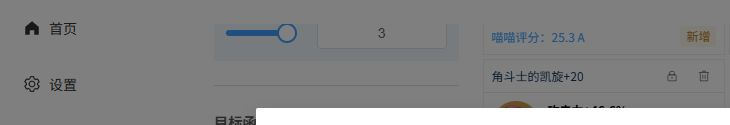

# 7.1.08beta 接口实测与问题清单

**2026-09-30 续查：U01 自定义敌人问题已在 repair4 修复，另补上禁用 BUFF 与零基准收益保护。当前进展及验证范围见 [repair4 续查记录](interface-parameters-7108.md)。下文其他矩阵数字和浏览器截图为 repair3 的历史证据。**

本轮按公开计算接口逐项实际调用，并操作本地网页验证。修复的是公共输入、路由、显示与错误处理中的可复现问题。**这份报告不等于“全部公式已校准”或“所有可能的 bug 已清零”。**

范围：单次伤害与单人配装为主要修复对象；理论套装排行、静态推荐和多人优化仅检查公共入口及既有边界。没有发布 GitHub，没有构建 Android，没有改 README，没有使用真实库存生成测试文件。原始发布内核与原有桥接 WASM 的哈希未变；重建了修复属性容量后的扩展内核。

2026-10-04 当前状态：七七定额 DSL、沃雅妮莎星扩散支援及普通 C2 作用域、漩流颂歌动态转换、薇斯纳自定义 DSL、显式星超导通用增伤／擢升均已完成源码修复；Astra 随后证实的薇斯纳普通 C2 漏算、编译通用星烁 BUFF 的旧原生作用域丢失也已完成源码修复，最新五项针对性证据见[两项 P2 续修记录](astra-followup-20261004.md)，此前四项证据见[前轮续修记录](pending-fixes-20261004.md)。库存原生静态权重仍缺，用户要求暂缓。下文全量计数和截图是原审计历史证据，本轮未重跑。

## 1. 本轮修复

| 编号 | 已复现的问题 | 修复结果与验证 |
| --- | --- | --- |
| F01 | 扩展内核的复杂属性图仍固定为 200 项；空·冰天赋 `AetherCryoTalent1` 写入新属性时，沃雅妮莎／薇斯纳出现索引越界和 `unreachable` | 容量按最后一个属性枚举计算；两种辉映模式在两位角色的伤害与优化接口通过，编译后真实 worker 也通过 |
| F02 | `DSLInterface.run(source, environment, artifacts)` 的 BUFF 转换误读取第一个参数；新角色 BUFF 未转译就进入旧内核 | 根据接口签名处理第二个参数，并把转换后的环境放回原位置；16 类此前会触发原生异常的 BUFF 路径得到修复；伤害、DSL、优化的代表配置数值一致 |
| F03 | 套装配置在单次接口叫 `artifact_config`，词条收益叫 `artifacts_config`；部分配置缺字段会直接触发 WASM 反序列化异常 | 增加公共接口规范化、兼容字段别名、按目录补全默认字段；不覆盖明确填写的字段；桑多涅／瑞希的套装精通收益与实际伤害增量一致 |
| F04 | 主表隐藏假设反应后，明细／曲线仍可能选中隐藏分支；目录实测发现 27 个错误默认选项 | 三处共用当前技能可见分支，优先选取实际直接星／月伤害；本轮 2034 个技能目录入口未再发现默认分支落在显示列表之外 |
| F05 | 伤害明细使用旧 UI 公式重算，星／月反应可能与主表不同；普通独立倍率与额外定额也容易混算 | 明细主数值直接使用同一次内核结果；月／星反应展示自身期望、暴击、非暴击值；普通分解明确标为临时估算，独立倍率乘技能本体，定额随后加入 |
| F06 | 剧变反应表中把原生通用占位 `direct_moonelectro: 0` 当作当前技能直接月感电伤害 | 移除这个错误入口；直接月感电在实际技能表显示；剧变表跳过非数值项，当前技能无关的星／月反应不添加“暂无伤害”空行 |
| F07 | 新武器的 `weapon_effects`／`weapon_precision` 等非数值元数据进入面板求和，生成异常字符串 | 面板聚合只接收有限数值映射；纺夜天镜和真语秘匣的曲线面板检查通过 |
| F08 | 词条分析、Playground 和库存推荐的一些异常未被 UI 接住；单个不支持的预设会中断推荐 | 显示具体错误；推荐跳过有明确原因的预设并告知用户；避免最大评分为 0 时除零。静态权重缺失本身仍列在未修复项 |
| F09 | 7.1.08beta 导出的 Debug 文件名仍硬编码 `7.1.07alpha1` | 文件名改为读取调试记录里的当前版本号；Debug 内容与本地保存行为不变 |
| F10（2026-10-02） | 旧路径拒绝 `StellarSwirlDamageMultiplier`，未消费星扩散本体独立倍率 | 两处旧内核共享计算点及桑多涅适配层接入；单次、候选配装、DSL、词条收益和源码编译 Worker 五项核对通过，定额不乘倍率；见[修复记录](stellar-swirl-multiplier-20261002.md) |

涉及的主要文件：`beta-data/interface-contracts.mjs`、`legacy-effect-bridge.mjs`、`facade.mjs`，`mona_core/src/attribute/complicated_attribute_graph.rs`，`src/algorithms/reaction-labels.mjs`、`stat-gain/curve.mjs`，以及伤害明细、单人计算、Playground、库存推荐组件。

F02 复现到的 16 个 BUFF 标识：`QiqiTalent2StellarConduct`、`KleeC1`、`FlinsC6`、`LaumaC6`、`YaeMikoC1`、`DurinC2`、`ZibaiC2`、`LinneaC6`、`SandroneC1`、`VodyanitsaE`、`VodyanitsaA4`、`VodyanitsaC1`、`VodyanitsaC2`、`VodyanitsaC6`、`VodyanitsaSignature`、`VodyanitsaA1`。杜林的缺失反应对象条件现在明确报错，未删掉条件限制。

## 2. 仍未解决的问题

### U01：自定义敌人未接入部分配装／词条收益接口——repair4 已修复

旧接口在候选评分时使用默认敌人，凯亚在 150 级、物抗 60% 下仍返回 `901.6518113437501`，而单次伤害为 `346.0885740511364`。

repair4 已把当前敌人的等级及八种抗性接入旧内核桥接与扩展内核的单人配装、词条收益接口。修复后两处同为 `346.0885740511364`；混合物理／冰伤目标也会按当前敌人重新选择装备。移除上一轮的临时不一致提示。详见 [本轮续查记录](interface-parameters-7108.md)。

### U02：部分旧目标没有静态圣遗物推荐权重

**功能仍缺失。** 134 个角色默认目标路径中，119 条原生静态评分没有实现；另有瑞希星扩散、薇斯纳两条路径明确不支持，共 121 条。这里指库存“推荐”使用的静态评分接口，不是实际单人优化，也不是页面中的喵喵圣遗物分数。

本轮把 `unreachable` 改成可理解的错误，并让推荐跳过不支持的预设；没有伪造权重。全部受影响角色／默认目标见文末。尚未遍历每个角色的所有其他目标来证明静态推荐全部可用。

### U03：保留的未适配与条件限制

| 项目 | 当前边界 |
| --- | --- |
| 薇斯纳 MONA-DSL | 2026-10-04 已接通既有原生 DSL，混合技能、实际候选及收益通过 |
| 杜林 `DurinTalent2`／`DurinC2` | 必须明确本次反应的另一元素；默认缺失时明确报错，属于条件未填写，不是偷偷忽略 BUFF |
| 沃雅妮莎向旧角色提供星扩散专属定额、暴伤、擢升 | 2026-10-04 已接通并验证；普通 C2 的旧图暴伤串区也已修复 |
| 旧角色使用漩流颂歌的动态生命转攻击 | 2026-10-04 已接入原生候选 HP→攻击依赖，实际单次／DSL／优化／收益和 Worker 已核对 |
| 3～4 人独立反应星扩散排序 | 已按用户要求移除，不属于待适配功能 |
| 理论排行与多人联动 | 本轮只调用代表入口；不宣称所有角色、武器或联动条件已完成校准 |

目录检查共出现 **139 次明确限制或条件错误**：静态评分 121，薇斯纳 DSL 1，旧角色星扩散独立倍率 3，杜林默认缺少反应对象 14。它们均保留在原始审计数据，未被算作普通数值通过。 其中“独立倍率 3”是当时目录核对记录的拒绝次数，不是所有受影响角色的名单；2026-10-02 的来源排查确认瑞希、奥黛塔、桑多涅、冰旅行者四条自身伤害路径，随后倍率接入已修复。这里的 139 次和倍率 3 次仍是原审计历史次数，没有改写旧原始证据。

## 3. 实际调用的公共接口

| 接口 | 本轮证据 | 结论范围 |
| --- | --- | --- |
| `CommonInterface.get_attribute` | 全部 134 个角色默认配置；BUFF 的 DSL 攻击面板对照 | 入口可调用，部分代表配置数值对照 |
| `CalculatorInterface.get_damage_analysis` | 2034 个技能；全部武器；全部套装／BUFF 在三种角色路径 | 当前目录入口及有限数值检查，非全状态公式验收 |
| `CalculatorInterface.get_transformative_damage` | 134 个角色默认配置 | 接口调用与显示项清理 |
| `OptimizeSingleWasm.optimize` | 255 把武器、189 组套装、771 组 BUFF；候选过滤；最低属性约束；真实打包 worker | 单人入口及代表候选一致性，自定义敌人缺口另列 |
| `DSLInterface.run` | 134 个默认角色、257 个 BUFF 的旧角色路径；凯亚／沃雅妮莎伤害对照 | 受已列限制约束 |
| `BonusPerStat.bonus_per_stat` | 全部 134 个角色默认配置；套装精通收益与单次增量对照 | 配置字段修复，自定义敌人缺口另列 |
| `CommonInterface.get_artifacts_rank_by_character` | 134 个默认目标 | 121 条明确不支持，完整名单见文末 |
| `CalcArtifactBestSet.calc_artifact_best_set` | 凯亚 MaxATK 合成输入返回 66 个有限结果 | 理论排行入口冒烟检查 |
| `PotentialInterface.get_potential` | 合成装备的 ArtifactEff | 潜力入口冒烟检查 |
| `TeamOptimizationWasm.optimize_team2` | 原生单角色目标与薇斯纳混合适配单角色目标 | 入口检查；未扩展为全队伍联动验收 |

矩阵总计 **5394 次调用**，其中 5255 次未抛出异常，139 次为上文明确列出的限制；修复后没有未知异常或错误默认伤害分支。

| 矩阵项 | 调用数 |
| --- | --- |
| `character.attribute` | 134 |
| `character.transformative` | 134 |
| `character.bonus` | 134 |
| `character.rank` | 134 |
| `character.dsl` | 134 |
| `skill.display` | 2034 |
| `weapon.damage` | 255 |
| `weapon.optimize` | 255 |
| `weapon.panel` | 2 |
| `set.damage` | 189 |
| `set.optimize` | 189 |
| `buff.damage` | 771 |
| `buff.optimize` | 771 |
| `buff.dsl` | 257 |
| `potential` | 1 |

配置口径：134 个角色目录项含旅行者等变体；武器 255；套装 63；BUFF 257。套装与 BUFF 分别覆盖凯亚（旧内核）、沃雅妮莎、薇斯纳；使用目录默认状态、零命、合成装备。不是这些目录的全组合穷举。

## 4. 回归与浏览器实测

回归文件：`tests/interface-audit-7108.test.mjs`。四组全部通过：目录矩阵，BUFF 的伤害／DSL／优化对照，套装配置／筛选／伤害分支与明细一致性，其余公共接口与真实编译 worker。没有运行整套历史测试。

浏览器使用独立端口 `4188`、独立数据目录和五件合成圣遗物：

- 菲林斯“雷霆交响月感电”：主表与明细均为期望 `6415`、暴击 `10553`、非暴击 `4877`，词条收益曲线能绘制。
- 桑多涅，默认筛选、“镜水析谬”目标：点击开始计算返回一组配装，目标值 `12273.2`；“重击冷凝射线·星超导”主表及明细期望 `12273`、暴击 `19404`、非暴击 `9997`。
- Debug 显示“计算完成 · 候选 5 件”，JSON 实际写入下载目录；内容版本为 `7.1.08beta`、状态 `completed`。修复导出文件名的旧 alpha 标记。
- 修改冰抗时出现 U01 提示，恢复默认值后提示消失。
- 独立星／月反应页默认双参与者月结晶返回非暴击 `1875.12`、全暴击 `2812.68`、严格期望 `1936.84`；三次合计期望 `5810.53`。
- 主计算页保留单次手填面板，星／月反应面板位于独立侧栏入口。

实测截图（合成数据）：

构建时网页服务目录会被重新生成；在构建中途点击旧页面曾因旧 worker 资源失效而失败，最终构建完成并刷新后配装成功。升级包应先关闭旧服务，再启动新目录并 Ctrl+F5 刷新，不应混用旧页面和新资源。

验证证据保存在源码的 `.build-target/interface-audit/`：`report.json`、`regression-final.log`、`web-build-final.log`。该目录不会加入网页包。原始私有调试文件没有被复制到源码或网页包。

## 5. 静态推荐未实现／不支持名单

以下为本轮逐项调用的角色和默认目标；不代表同角色所有其他目标也经过测试。

| 角色 | 本轮目标标识 | 状态 |
| --- | --- | --- |
| 空-风 `AetherAnemo` | `MaxATK` | 原生静态权重未实现 |
| 空(草) `AetherDendro` | `AetherDendroDefault` | 原生静态权重未实现 |
| 空(雷) `AetherElectro` | `MaxATK` | 原生静态权重未实现 |
| 空(岩) `AetherGeo` | `MaxATK` | 原生静态权重未实现 |
| 空(水) `AetherHydro` | `MaxATK` | 原生静态权重未实现 |
| 空-冰 `AetherCryo` | `AetherCryoDefault` | 原生静态权重未实现 |
| 空-火 `AetherPyro` | `MaxATK` | 原生静态权重未实现 |
| 阿贝多 `Albedo` | `AlbedoDefault` | 原生静态权重未实现 |
| 艾尔海森 `Alhaitham` | `AlhaithamDefault` | 原生静态权重未实现 |
| 埃洛伊 `Aloy` | `AloyDefault` | 原生静态权重未实现 |
| 安柏 `Amber` | `AmberDefault` | 原生静态权重未实现 |
| 荒泷一斗 `AratakiItto` | `AratakiIttoDefault` | 原生静态权重未实现 |
| 白术 `Baizhu` | `MaxATK` | 原生静态权重未实现 |
| 芭芭拉 `Barbara` | `BarbaraDefault` | 原生静态权重未实现 |
| 北斗 `Beidou` | `BeidouDefault` | 原生静态权重未实现 |
| 班尼特 `Bennett` | `BennettDamage` | 原生静态权重未实现 |
| 坎蒂丝 `Candace` | `MaxATK` | 原生静态权重未实现 |
| 夏洛蒂 `Charlotte` | `MaxATK` | 原生静态权重未实现 |
| 重云 `Chongyun` | `ChongyunDefault` | 原生静态权重未实现 |
| 柯莱 `Collei` | `MaxATK` | 原生静态权重未实现 |
| 赛诺 `Cyno` | `CynoDefault` | 原生静态权重未实现 |
| 迪希雅 `Dehya` | `DehyaDefault` | 原生静态权重未实现 |
| 迪卢克 `Diluc` | `DilucDefault` | 原生静态权重未实现 |
| 迪奥娜 `Diona` | `DionaDefault` | 原生静态权重未实现 |
| 多莉 `Dori` | `MaxATK` | 原生静态权重未实现 |
| 杜林 `Durin` | `DurinDefault` | 原生静态权重未实现 |
| 优菈 `Eula` | `EulaDefault` | 原生静态权重未实现 |
| 珐露珊 `Faruzan` | `FaruzanDamage` | 原生静态权重未实现 |
| 菲谢尔 `Fischl` | `FischlDefault` | 原生静态权重未实现 |
| 菲米尼 `Freminet` | `FreminetDefault` | 原生静态权重未实现 |
| 芙宁娜 `Furina` | `FurinaDefault` | 原生静态权重未实现 |
| 甘雨 `Ganyu` | `GanyuDefault` | 原生静态权重未实现 |
| 五郎 `Gorou` | `GorouDefault` | 原生静态权重未实现 |
| 胡桃 `HuTao` | `HuTaoDefault` | 原生静态权重未实现 |
| 伊法 `Ifa` | `MaxATK` | 原生静态权重未实现 |
| 雅珂达 `Jahoda` | `MaxATK` | 原生静态权重未实现 |
| 琴 `Jean` | `JeanDefault` | 原生静态权重未实现 |
| 枫原万叶 `KaedeharaKazuha` | `KaedeharaKazuhaDamage` | 原生静态权重未实现 |
| 凯亚 `Kaeya` | `KaeyaDefault` | 原生静态权重未实现 |
| 神里绫华 `KamisatoAyaka` | `KamisatoAyakaDefault` | 原生静态权重未实现 |
| 神里绫人 `KamisatoAyato` | `KamisatoAyatoDefault` | 原生静态权重未实现 |
| 卡维 `Kaveh` | `MaxATK` | 原生静态权重未实现 |
| 刻晴 `Keqing` | `KeqingDefault` | 原生静态权重未实现 |
| 可莉 `Klee` | `KleeDefault` | 原生静态权重未实现 |
| 九条裟罗 `KujouSara` | `KujouSaraDamage` | 原生静态权重未实现 |
| 久岐忍 `KukiShinobu` | `KukiShinobuDefault` | 原生静态权重未实现 |
| 莱依拉 `Layla` | `MaxATK` | 原生静态权重未实现 |
| 丽莎 `Lisa` | `LisaDefault` | 原生静态权重未实现 |
| 琳妮特 `Lynette` | `MaxATK` | 原生静态权重未实现 |
| 林尼 `Lyney` | `LyneyDefault` | 原生静态权重未实现 |
| 莫娜 `Mona` | `MonaDefault` | 原生静态权重未实现 |
| 纳西妲 `Nahida` | `NahidaDefault` | 原生静态权重未实现 |
| 那维莱特 `Neuvillette` | `NeuvilletteDefault` | 原生静态权重未实现 |
| 妮露 `Nilou` | `NilouDefault` | 原生静态权重未实现 |
| 凝光 `Ningguang` | `NingguangDefault` | 原生静态权重未实现 |
| 诺艾尔 `Noelle` | `NoelleDefault` | 原生静态权重未实现 |
| 米卡 `Mika` | `MikaDefault` | 原生静态权重未实现 |
| 七七 `Qiqi` | `QiqiDefault` | 原生静态权重未实现 |
| 雷电将军 `RaidenShogun` | `RaidenShogunDefault` | 原生静态权重未实现 |
| 雷泽 `Razor` | `RazorDefault` | 原生静态权重未实现 |
| 罗莎莉亚 `Rosaria` | `RosariaDefault` | 原生静态权重未实现 |
| 珊瑚宫心海 `SangonomiyaKokomi` | `SangonomiyaKokomiDefault` | 原生静态权重未实现 |
| 早柚 `Sayu` | `SayuDefault` | 原生静态权重未实现 |
| 申鹤 `Shenhe` | `ShenheDefault` | 原生静态权重未实现 |
| 鹿野院平藏 `ShikanoinHeizou` | `ShikanoinHeizouDefault` | 原生静态权重未实现 |
| 砂糖 `Sucrose` | `SucroseDefault` | 原生静态权重未实现 |
| 达达利亚 `Tartaglia` | `TartagliaDefault` | 原生静态权重未实现 |
| 托马 `Thoma` | `ThomaDefault` | 原生静态权重未实现 |
| 提纳里 `Tighnari` | `TighnariDefault` | 原生静态权重未实现 |
| 法尔伽 `Varka` | `VarkaDefault` | 原生静态权重未实现 |
| 温迪 `Venti` | `VentiDefault` | 原生静态权重未实现 |
| 流浪者 `Wanderer` | `WandererDefault` | 原生静态权重未实现 |
| 莱欧斯利 `Wriothesley` | `WriothesleyDefault` | 原生静态权重未实现 |
| 奇偶·风 `ManekinaAnemo` | `ManekinaAnemoDefault` | 原生静态权重未实现 |
| 奇偶·冰 `ManekinaCryo` | `ManekinaCryoDefault` | 原生静态权重未实现 |
| 奇偶·草 `ManekinaDendro` | `ManekinaDendroDefault` | 原生静态权重未实现 |
| 奇偶·雷 `ManekinaElectro` | `ManekinaElectroDefault` | 原生静态权重未实现 |
| 奇偶·岩 `ManekinaGeo` | `ManekinaGeoDefault` | 原生静态权重未实现 |
| 奇偶·水 `ManekinaHydro` | `ManekinaHydroDefault` | 原生静态权重未实现 |
| 奇偶·火 `ManekinaPyro` | `ManekinaPyroDefault` | 原生静态权重未实现 |
| 香菱 `Xiangling` | `XianglingDefault` | 原生静态权重未实现 |
| 魈 `Xiao` | `XiaoDefault` | 原生静态权重未实现 |
| 行秋 `Xingqiu` | `XingqiuDefault` | 原生静态权重未实现 |
| 辛焱 `Xinyan` | `XinyanDamage` | 原生静态权重未实现 |
| 八重神子 `YaeMiko` | `YaeMikoDefault` | 原生静态权重未实现 |
| 烟绯 `Yanfei` | `YanfeiDefault` | 原生静态权重未实现 |
| 瑶瑶 `Yaoyao` | `MaxATK` | 原生静态权重未实现 |
| 夜兰 `Yelan` | `YelanDefault` | 原生静态权重未实现 |
| 宵宫 `Yoimiya` | `YoimiyaDefault` | 原生静态权重未实现 |
| 云堇 `Yunjin` | `YunjinDefault` | 原生静态权重未实现 |
| 钟离 `Zhongli` | `ZhongliDefault` | 原生静态权重未实现 |
| 绮良良 `Kirara` | `MaxATK` | 原生静态权重未实现 |
| 夏沃蕾 `Chevreuse` | `MaxATK` | 原生静态权重未实现 |
| 娜维娅 `Navia` | `NaviaDefault` | 原生静态权重未实现 |
| 闲云 `Xianyun` | `XianyunDefault` | 原生静态权重未实现 |
| 千织 `Chiori` | `ChioriDefault` | 原生静态权重未实现 |
| 阿蕾奇诺 `Arlecchino` | `ArlecchinoDefault` | 原生静态权重未实现 |
| 克洛琳德 `Clorinde` | `ClorindeDefault` | 原生静态权重未实现 |
| 希格雯 `Sigewinne` | `SigewinneDefault` | 原生静态权重未实现 |
| 赛索斯 `Sethos` | `SethosDefault` | 原生静态权重未实现 |
| 艾梅莉埃 `Emilie` | `EmilieDefault` | 原生静态权重未实现 |
| 卡齐娜 `Kachina` | `MaxATK` | 原生静态权重未实现 |
| 玛拉妮 `Mualani` | `MualaniDefault` | 原生静态权重未实现 |
| 基尼奇 `Kinich` | `KinichDefault` | 原生静态权重未实现 |
| 希诺宁 `Xilonen` | `XilonenDefault` | 原生静态权重未实现 |
| 恰斯卡 `Chasca` | `ChascaDefault` | 原生静态权重未实现 |
| 蓝砚 `Lanyan` | `LanyanDefault` | 原生静态权重未实现 |
| 玛薇卡 `Mavuika` | `MavuikaDefault` | 原生静态权重未实现 |
| 茜特菈莉 `Citlali` | `CitlaliDefault` | 原生静态权重未实现 |
| 梦见月瑞希 `YumemizukiMizuki` | `YumemizukiMizukiStellarSwirl` | 明确不支持静态评分 |
| 伊安珊 `Iansan` | `MaxATK` | 原生静态权重未实现 |
| 瓦雷莎 `Varesa` | `VaresaDefault` | 原生静态权重未实现 |
| 爱诺 `Aino` | `AinoDefault` | 原生静态权重未实现 |
| 伊涅芙 `Ineffa` | `IneffaDefault` | 原生静态权重未实现 |
| 菲林斯 `Flins` | `FlinsDefault` | 原生静态权重未实现 |
| 奈芙尔 `Nefer` | `NeferDefault` | 原生静态权重未实现 |
| 菈乌玛 `Lauma` | `LaumaDefault` | 原生静态权重未实现 |
| 塔利雅 `Dahlia` | `MaxATK` | 原生静态权重未实现 |
| 布伦妮 `Prune` | `PruneDefault` | 原生静态权重未实现 |
| 沃雅妮莎 `Vodyanitsa` | `VodyanitsaDefault` | 原生静态权重未实现 |
| 薇斯纳 `Vesna` | `VesnaDefault` | 明确不支持静态评分 |
